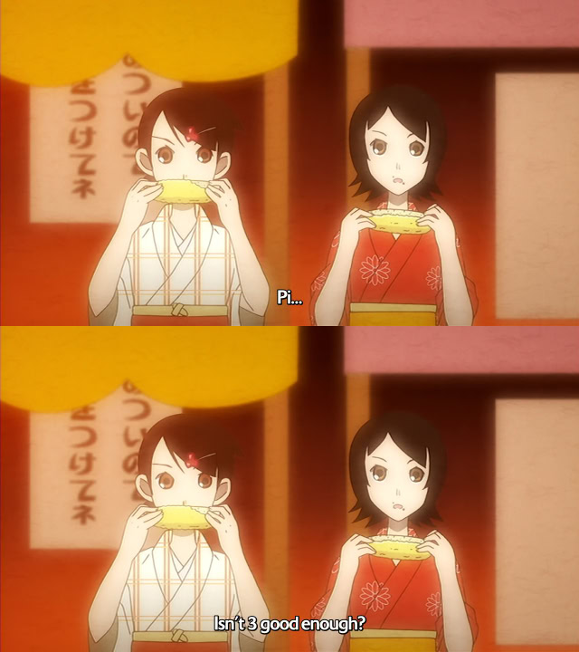

# Renoise research

Results come primarily from empirical, black-box testing (i.e. poking at inputs and observing the output). Primarily related to playback, and so may be of interest to e.g. programmers looking to implement their own Renoise-compatible playback routine or musicians interested in more technical aspects of the DAW.

All tests performed on Renoise 3.4.3, behavior in other versions may vary.

## Mapping curves

Renoise has two logarithmic and two exponential curve mappings. Those are used extensively throughout the DAW, formulas currently unknown.

There's also a set of other curves:

The "pow102" curve: $\frac{10^{2x}-1}{10^2-1}$
The "log102" curve: $\frac{\log_{10}\left(99x+1\right)}{2}$

Those are used for e.g. frequency scaling for filters etc.

## Envelopes

There are three types of envelope points: `Points`, `Lines` and `Curves`.

`Points` simply hold the value until next sample point.

`Lines` linearly interpolate between points by default, but allow for an exponential scaling factor. The curvature can be expressed as $y = x^{1+|16b|}$, where $b$ is the editor scaling value (from -1.0 to 1.0).

`Curves` are not covered, as they have an exceptional lack of flexibility and there is usually no reason to use them over `Lines`.


## Sampler

Note Off events always cause a brief fadeout, implemented with a 1-tap filter. The declick coefficient is tuned to about 110 Hz. The declick fadeout always happens, even when NNA is set to "Cut".

There's an "auto fade" option, which applies a fade in+out to a sample. The 1-tap fadeout starts 12ms before the end of the sample, and settles at about -72dB at the last sample. Fade in seems to use a similar coefficient.

The maximum number of sample voices an instrument can play on a single note column (think release tails, or NNA of `Continue`) is 12. The sample voices are shared across the entire instrument, so if you e.g. have 12 different samples playing in an instrument at the same time, it essentially turns monophonic.[^1] This is easy to implement and simplifies channel state allocation.

Oversampling appears to be 2x. Enabling oversampling introduces a delay of 8 samples, as the delay introduced by the FIR decimator is not compensated for.

[^1]: It also has a funny consequence: if an instrument has more than 12 samples assigned to the same note, a note event will only play the 12 last ones. "imagine someone doing manual additive synthesis in renoise with the sampler and getting mad at this"

## Modulation

Modulation appears to be processed at intervals of 1/256th of the tempo (so e.g. for 120BPM, modulation gets processed at a rate of 512 Hz). `Volume`, `Panning`, and `Drive` are ramped linearly between points. `Cutoff` and `Resonance` appear to use some single-tap smoothing coefficient instead[^2]. `Pitch` is not interpolated at all.

[^2]: This may be inherent to the filters themselves, rather than the modulation system. However, the coefficient present in the `Analog Filter` effect is different and smooths parameters much more aggressively, even at the "Instant" inertia setting.

Modulation devices modulate the input with an operand of choice. Since division is available, it's possible to reach values such as infinity (positive and negative) and NaN. By the end of the modulation chain, infinity (regardless of sign) gets substituted with max value, while NaN gets substituted by zero. The values always get clamped. The range is 0 to 1.0 for `Cutoff`, `Resonance` and `Drive`. For `Panning` and `Pitch`, the range is instead -1.0 to 1.0. Volumes range from 0.0 to 4.0 (about +24.08dB). There is a limit of 12 modulation devices per target.

## Instrument filterbank

### "Clean" filters

Those are just a basic biquad, with a twist. LP/HP/BP Clean is weird, because it doesn't even match Renoise's "Biquad" behavior in "Digital Filter". It has more resonance and some odd damping curve.

Cutoff frequency scaling is done with the "pow102" curve, times 17960 plus 40. The Q calculation formula for a given resonance value appears to be $15.65x^{2}+0.35$.

Exact formula for gain is unknown. Here are the measurements for some resonance values:

|step|gain (dB)|
|-----|--------|
| 0.0 |  0.407 |
| 0.1 |  0.233 |
| 0.15 |  0.000 |
| 0.2 | -0.286 |
| 0.3 | -1.048 |
| 0.4 | -2.058 |
| 0.5 | -3.194 |
| 0.6 | -4.398 |
| 0.7 | -5.618 |
| 0.8 | -6.863 |
| 0.9 | -8.044 |
| 1.0 | -9.275 |

Given the data, a quartic fit can be made, which provides a "good enough" result (formula already yields a raw gain factor rather than decibels):

$$y=-1.15841x^{4}+3.26702x^{3}-2.86373x^{2}+0.0513749x+1.04762$$

"LP Clean" and "HP Clean" use those formulas directly. "BP Clean" uses identical formulas, except for gain, which is doubled (about +6.02dB).


## Volume column

Volume changes in pattern editor always get smoothed. The 1-tap smoothing coefficient for immediate change is tuned to about 27.5 Hz.[^3] There is another, faster coefficient, identical to the declick one. Coefficient is set to a "fast" one by most of volume effects. The coefficient resets to the "slow" one on the start of a line.

[^3]: Likely the same for panning, but untested.

Volume increments are in 1/127ths. `80h` is identical to `7Fh`.

## Delay column

Here be dragons.

Modulation gets correctly delayed, which suggests it functions completely independent from any pattern logic.

Effects will generally start processing only on the ticks right as, or before the note starts playing. This means e.g. arpeggio will start delayed or pitch slides will skip steps (and potentially end up in an unwanted state).

## Pattern effects

Pattern effect updates generally happen on tick boundaries. Ticks are counted per line, and can range from 1 to 16 per line.

All behavior applies to "Renoise" playback compatibility options. Amiga/FT2 compatibility options will not be covered.

### Arpeggio (Axy)

Cycles semitone offset of a note between 0, `x` and `y` in a loop every tick. Arpeggio position is retained as long as any kind of arpeggio is active.

#### Quirks
Arpeggios can be combined. The offsets accumulate, while the position is shared for a given note. For instance:

```
   | Note   | FX   FX
   |--------|----------
00 | C-4 00 | .A12 .A34
```

This pattern row will cycle between note offsets of +3, +2, and +5. Breakdown:
```
         012   034
tick 0:  0   +  3  = 3
tick 1:    2 + 0   = 2
tick 2:   1  +   4 = 5
```

- Tick 0: 
    - First FX column executes, 0 gets added to note offset. Arpeggio position is now 1.
    - second FX column executes, 3 gets added to note offset, Arpeggio position is now 2, total note offset is +3.
- Tick 1: 
    - First FX column executes, 2 gets added to note offset. Arpeggio position is now 0.
    - second FX column executes, 0 gets added to note offset, Arpeggio position is now 1, total note offset is +2.
- Tick 2: 
    - First FX column executes, 1 gets added to note offset. Arpeggio position is now 2.
    - second FX column executes, 4 gets added to note offset. Arpeggio position is now 0, total note offset is +5.


### Pitch slide up (Uxx) and down (Dxx)

Slides pitch up or down, where `xx` are 1/16ths of a semitone over the span of a line. `xx` of `00` is a special case that reuses previous slide value. Slide value is remembered on an FX row basis.

Specifically, it finalizes the slide and reaches the target pitch on the last tick of the line, in increments of `xx / (ticks_per_line - 1)`. If a slide is already occurring, the increment happens on the first tick of the line as well, with increments instead being `xx / ticks_per_line`. For instance:

```
   | Note   | FX   FX  
   |--------|----------
00 | C-4 00 | .UC0 ZK02
01 | ... .. | .UC0 ....
```

This pattern will have pitch offsets as follows:
```
Row 00, tick 0:   +0
Row 00, tick 1:  +12
Row 01, tick 0:  +18  <- increment is now 6
Row 01, tick 1:  +24
```
Ticks per line value of 1 is a special case - the slide immediately finalizes at a given offset, regardless if there is a slide happening or not.

Slides combine without problems, resulting in a sum of offsets, e.g. `U60` and `D60` on the same row will result in no pitch change.

Slides can combine with arpeggios just fine. The following will play a constant note for two rows:

```
   | Note   | FX   FX   FX   FX  
   |--------|--------------------
00 | C-4 00 | .D60 .A60 .A00 ZK02 
01 | ... .. | .D60 .A09 .A0C ....
```

### Glide to note (Gxx)

In many respects, behaves similarly to `Uxx`/`Dxx`, except that it slides towards the target note. If occuring on the same row as a note event and a note is already playing, it will change its target note rather than retriggering.

`GFF` is a special case in that it immediately snaps to the target note on the very first tick.

`G00` shares the remembered slide value with `Uxx`/`Dxx`.

Glide works on the same offset value as the slides. Since the slides don't change the target note, `Gxx` commands can be used to snap back to it. For instance, in the following `G60` will snap back to C-4, just like `U60` would do:

```
   | Note   | FX  
   |--------|-----
00 | C-4 00 | .D60
01 | ... .. | .G60
```

### Vibrato (Vxy)

`x` is speed - vibrato period will take roughly $\frac{4 \pi}{x}$ lines, so e.g. $4\pi$ lines at speed of 1, $2\pi$ lines at speed of 2, $\pi$ lines at speed of 4, and so on.
`y` is depth, measured in 1/8ths of a semitone, so e.g. `y` of 8 will oscillate between -1 and +1 semitones.

Vibrato position gets accumulated for a given note and only resets on retrigger, i.e vibrato effects don't need to be continuous to retain their position.

The vibrato resolves to `rate = 2^(sin(lines * x / 2) * y / (8*12))`, where `x` is speed and `y` is depth.

$$r = 2^{\frac{y}{96} \sin(\frac{lx}{2}) }$$

Vibrato gets updated on tick boundaries, but speed is NOT dependent on tickrate.

#### Speed quirk

Preliminary testing suggested that the period is based on $4\pi \approx 12.566$, but measurements instead seem to point towards a figure of approximately $12.446$. It's unclear where the deviation comes from.[^4]

[^4]:  

### Fade in (Ixx) and out (Oxx)

Note that `xx` is in 1/256th steps, while the volume column itself is 1/127th steps (`00h` to `80h` inclusive), ergo it's typically not possible to reach the same volume values as by directly setting the volume value. Value of `00` is special in that it reuses the previous value.

Calculation of tick increments happens in a similar manner to pitch slides, i.e. volume change finalizes on the last tick of a line, and if a fade is already occuring, the increment happens on the first tick as well.

The volume changes are smoothed, and the coefficient is the "fast" one.

### Tremolo (Txy)

`x` is speed - appears to be calculated identically to vibrato.
`y` is depth - volume multiplier will oscillate from $1$ to $1-\frac{y}{15}$.

Note that the effect multiplies the current volume, rather than subtracting from it. Smoothing coefficient appears to be the same as for volume fades.

TODO: find out if it changes the volume smoothing coefficient, or if it somehow applies on top

### Cut volume (Cxy)

`x` - new volume, in 1/15th steps.
`y` - delay in ticks.

#### Quirks

Volume gets reapplied on every tick after reaching the target tick, rather than just the first one.

`y` of 0 is equivalent to `y` of 1.

The effect becomes a no-op when `y >= ticks_per_line`, but executing the effect still changes the volume smoothing coefficient to a fast one. For instance:

```
   | Note      | Note      | FX  
   |-----------|-----------|-----
00 | C-4 00 00 | C-4 01 00 | ZK04
01 | ... .. 80 | ... .. 80 | .C04
```

Both notes will end up with the same volume, but the one played with instrument 01 will have a sharper transition.

### Set note volume (Mxx)

Sets note volume in `xx` 1/255th increments.

Does not appear to change the volume smoothing coefficient, so it smooths out slowly if no other volume FX are present.

### Trigger slice (Sxx)

This effect has three modes, an "offset" mode, a "slice" mode, and a "phrase" mode. If the sample played has any slices belonging to it, the effect functions in a "slice" mode. If a key has a phrase assigned, "phrase" mode takes priority over other modes.

**In "offset" mode:** triggers a sample from an offset of `xx` 1/256ths.  Offset of 0 is a no-op. Triggering a non-zero offset will make the volume slowly fade in, regardless of whether auto fade is enabled in sample settings.

**In "slice" mode:** triggers a slice number `xx`, unless there is no slice with a number `xx`. Invalid slices are a no-op, except for `0`, which for some reason doesn't play a sample at all. Unlike offsets, slices don't play with a fade-in.

**In "phrase" mode:** triggers the phrase starting from given row number. If `xx` is larger than the phrase length, it starts from the last row.

#### Quirks

If an offset ends up on a fractional sample, it rounds to zero (contrary to what the sample editor ruler seems to suggest, which is rounding to nearest).

This effect doesn't stack (only the rightmost applies), so you cannot use 2 commands on the same row to e.g. trigger an offset of a slice (need to trigger the slice by keymap instead).

If the loop mode is `Forward` and the offset is past the loop end, the offset will immediately snap to the beginning of the loop.

If the loop mode is `Backward` or `PingPong` and the offset is past the loop end, the sample will start playing backwards from a given offset.

If combined with `B00`, sample offset starts from the end of the sample, i.e. `01` becomes equivalent to `FF` when playing forwards, and so on. The same does **not** happen with phrase offset.

### Play backwards (Bxx)

`xx` of 00 to play backwards. Other values are a no-op. Has a "sample" mode and a "phrase" mode, latter engages if a key has a phrase assigned.

**In "sample" mode:** Plays the sample backwards, starting from the last sample.

**In "phrase" mode:** Plays the phrase backwards, starting from the last row.

#### Quirks

Loop mode is unaffected. That means that `Forward` will bounce off the loop start and continue looping forward, `Backward` will loop backward.

If loop release is enabled, and loop mode is `Forward`, the playback direction of release will depend on whether the loop has been reached. If the loop has been reached, the sample will exit playing forwards, otherwise it will exit playing backwards. If the loop mode is `PingPong`, it will always bounce back and exit playing forwards. If the loop mode is `Backward`, it will always exit playing backwards.

If combined with sample offset and the offset lands past the loop start, the sample will not loop at all, regardless of loop mode.

### Envelope offset (Exx)

Retriggers selected envelope devices from a given offset. The retrigger applies to **every single device** in a modulation set.

For AHDSR, Envelope and Fader, the offset is `xx` 1/256ths[^5] of total modulation length (excluding `Release` for envelopes and AHDSR).

[^5]: TODO: needs formal validation if its 1/255 or 1/256

TODO: Figure out what happens if you restart modulation after a sample already stops playing (release over, etc)


